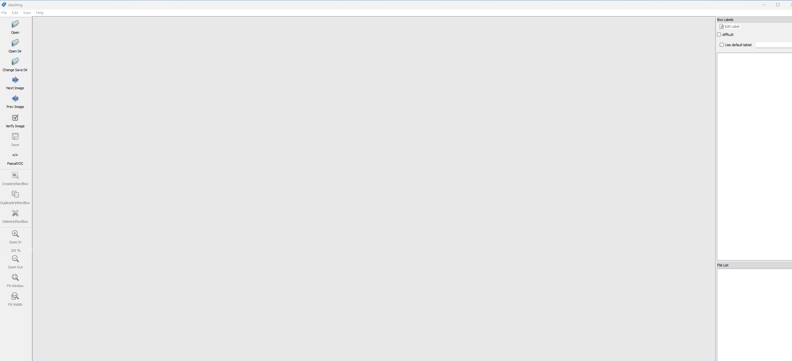
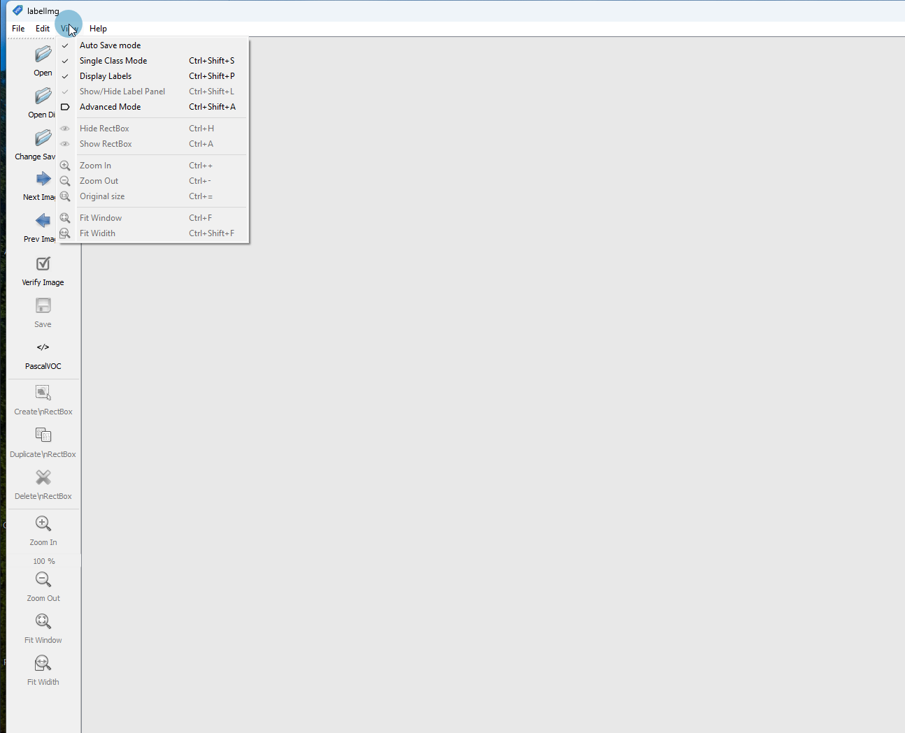
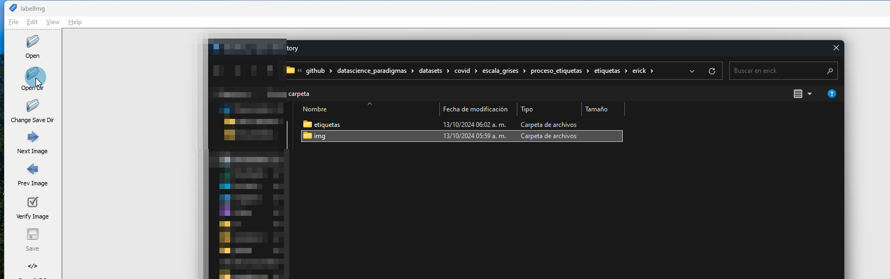
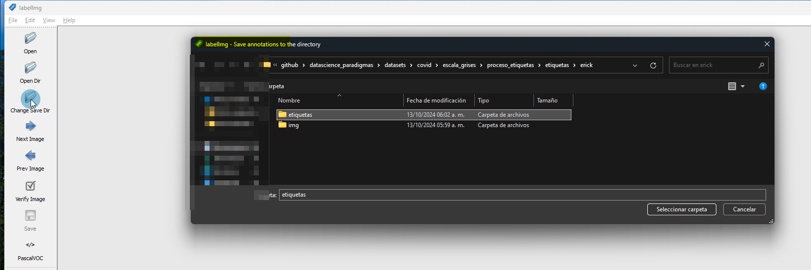
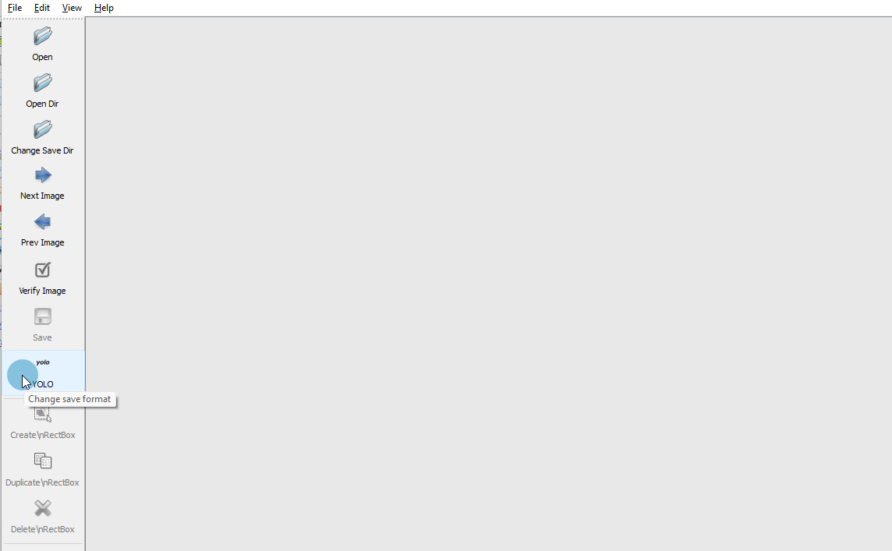
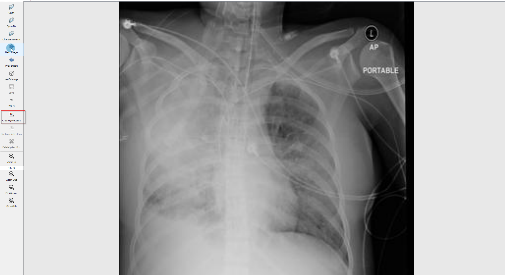
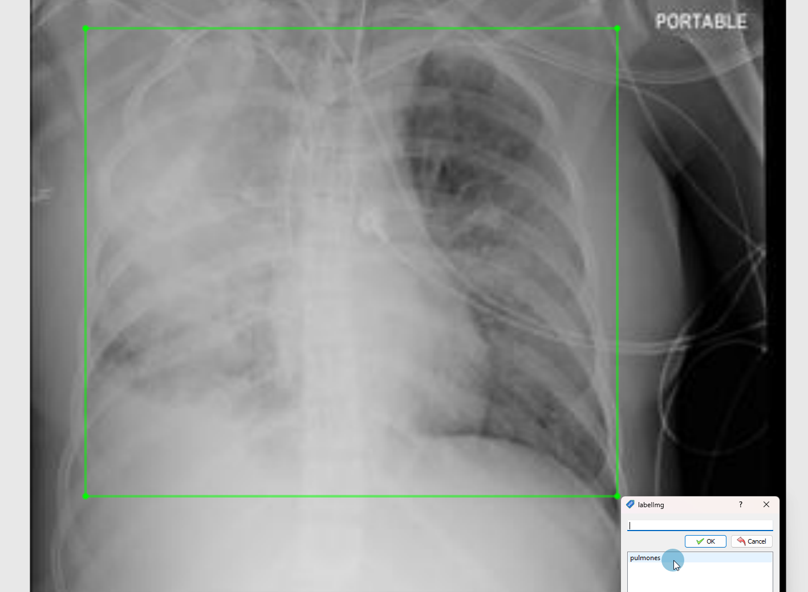

# labelImg
Es un software bastante conocido para realizar de manera gráfica la etiquetación. En este caso buscamos generar un conjunto de datos para entrenar un modelo conocido como  [yolov7](https://github.com/WongKinYiu/yolov7) y segmentar las imágenes de radiografías para obtener el area donde se encuentran los pulmones.

## Instalación de labelImg

La guía oficial puede ser encontrada en [instalación](https://github.com/HumanSignal/labelImg) pero, en muchos casos hay errores durante su uso y al menos para la plataforma de <code>windows</code> puede usarse el <code>.exe</code> dentro de 
<code>plataforma/windows/labelImg.exe</code> o descargar directamente el comprimido [aqui](https://github.com/HumanSignal/labelImg/releases/tag/v1.8.1)

### Uso

1. Abrir el software
   1. 
1. Activar algunas opcciones que facilitan el trabajo en la tab de view
   1. 
2. Configurar Folder en donde se encuentran las imagenes a etiquetar
   1. 
3. Configurar Folder en donde se van a guardar las etiquetas
   1. 
4. Clickear para cambiar el formato de las etiquetas a YOLO
   1. 
5. Solo falta dar a Next Image y presionar el atajo w o el boton resaltado
   1. 
6. Asegurarse de no crear mas etiquetas y asignar 'pulmones'
   1. 
7. Dar en ok, y continuar con cada imagen(en todo momento se puedo modificar esta imagen) presinando Next Image
   1. 